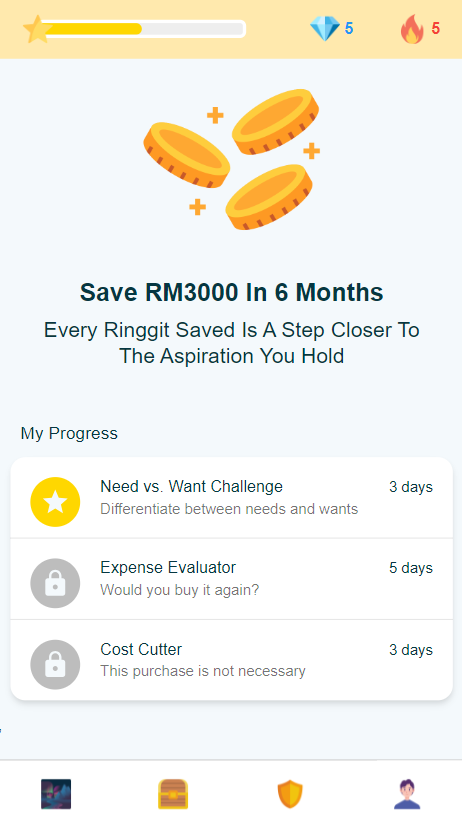

## About

An genAI-powered app designed with Gamification in mind to help users realize their personal growth and financial goals. 

It combines motivation, habit tracking, and financial planning into a single, user-friendly interface.

Submission for [DevHack 2023](https://gdg.community.dev/events/details/google-gdg-george-town-presents-devhack-kick-off-x-hackathon-101-create-a-change/)

### [Link to youtube video](https://youtu.be/6bZ-2omfMY8)



## Tools

- React

## To run the app locally

```
npm install
```

Then

```
npm start
```

to start the server and develop
